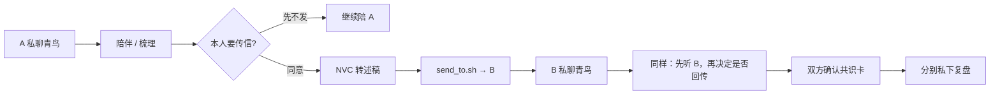
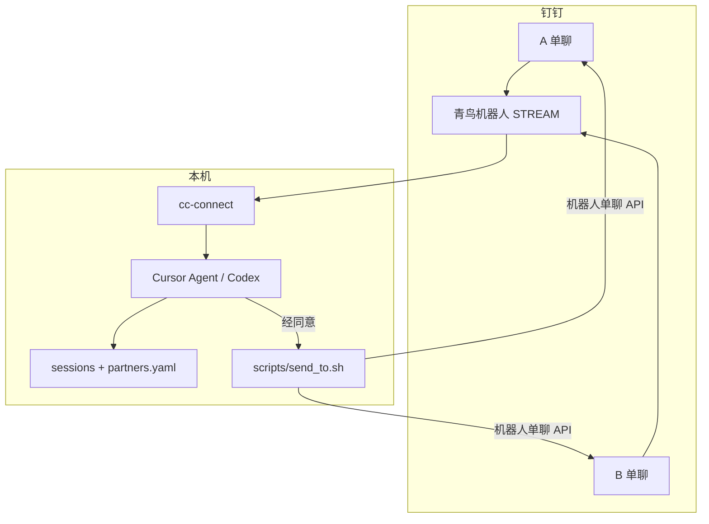

<p align="center">
  
</p>

<h1 align="center">QingNiao · 青鸟</h1>

<p align="center">
  <strong>钉钉情侣调解 AI · 亲密关系修复智能体</strong><br>
  Privacy-first AI mediator for couples on DingTalk.
</p>

<p align="center">
  先安抚眼前这个人，再修复两个人的关系。<br>
  <em>青鸟殷勤为探看</em> — 李商隐《无题》
</p>

<p align="center">
  <a href="#它做什么"></a>
  <a href="#架构"></a>
  <a href="#隐私设计"></a>
  <a href="#调解协议"></a>
</p>

---

青鸟不是传话机器人。它是跑在你本机上的**关系修复搭档**：一方私聊倾诉时，先被听见；只有本人点头，才会把话翻译成对方听得进的语言，送过去。

适合：情侣 / 夫妻沟通、冲突降温、把「你总是 / 你从不」改写成可执行的请求。  
不是：心理治疗、法律咨询、情绪宣泄树洞的替代品。

## 目录

- [它做什么](#它做什么)
- [为什么不是把聊天记录丢给大模型](#为什么不是把聊天记录丢给大模型)
- [它怎么工作](#它怎么工作)
- [架构](#架构)
- [隐私设计](#隐私设计)
- [快速开始](#快速开始)
- [调解协议](#调解协议)
- [仓库结构](#仓库结构)
- [路线图](#路线图)

## 它做什么

双方各自私聊同一个钉钉机器人「青鸟」。冲突来了，它按四件事工作：

| 职责 | 做什么 | 不做什么 |
|------|--------|----------|
| **陪伴** | 接住情绪，让人先被懂 | 不急着裁判、不急着传话 |
| **洞察** | 分开事实 / 感受 / 诉求 | 不替任何一方辩护 |
| **传信** | 用非暴力沟通改写，经同意再发 | 不转发原文、不偷看对方线程 |
| **复盘** | 冲突过后，私下给每人 2–3 条可操作建议 | 不公开点名谁更差 |

传信只是工具。很多人只是需要有人懂自己；聊完若说「我想想，我自己去谈」——这也是成功。

## 为什么不是把聊天记录丢给大模型

| 常见做法 | 青鸟 |
|----------|------|
| 一个会话里两边一起说 | **双通道私聊**，A 的原文 B 永不可见 |
| 模型「记得」你们是谁 | 闲置会重置会话；**每轮用脚本先验身份** |
| 直接把气话转给对方 | **草稿 → 本人确认 → 才推送** |
| 状态存在 prompt 里 | 状态写在 `sessions/` 文件里，重启也不丢 |

闲置约 30 分钟后，Agent 会忘掉刚才是谁。所以身份不靠记忆，靠 `scripts/whoami.sh`；阶段不靠印象，靠 `sessions/<topic>/state.json`。

## 它怎么工作



状态机（节选）：`idle` → `holding_*` → `exploring_*` → `draft_pending_*` → `awaiting_reply_*` → `converging` → `coaching_*` → `resolved`。危机（家暴、自伤等）进入 `crisis`：停止调解，不停止陪伴。

完整协议见 [`AGENTS.md`](./AGENTS.md)。

## 架构



- **桥接**：[cc-connect](https://github.com/chenhg5/cc-connect)（钉钉 Stream ↔ Agent CLI）
- **协议**：[`AGENTS.md`](./AGENTS.md)（注入 Agent 的工作宪法）
- **真相**：文件，不是聊天记忆
- **跨人推送**：只能走 [`scripts/send_to.sh`](./scripts/send_to.sh)；目标若等于当前发送者，脚本会拒绝（退出码 4）

## 隐私设计

青鸟按「调解室」而不是「群聊机器人」来建：

- 真实身份、凭证、私聊线程**只留本机**：`config/partners.yaml`、`.env`、`sessions/current/` 均已 gitignore
- 仓库里只有 [`config/partners.example.yaml`](./config/partners.example.yaml) 与 [`sessions/template/`](./sessions/template)
- 未经同意，不转述一方的原话、情绪细节、私密内容
- 运维事故写 [`ops/incidents.md`](./ops/incidents.md)，禁止写进当事人线程

> 青鸟是沟通助手，不替代专业心理咨询或法律服务。若出现家暴、控制或自伤风险，请寻求当地专业帮助。

## 快速开始

完整步骤：[docs/setup.md](./docs/setup.md)

```bash
# 1. 桥接与 Agent（Cursor `agent` 或 Codex 二选一）
npm install -g cc-connect

# 2. 本机身份与会话（勿提交）
cp config/partners.example.yaml config/partners.yaml
cp -R sessions/template sessions/current
cp docs/cc-connect.config.example.toml ~/.cc-connect/config.toml
# 编辑 partners.yaml、config.toml；凭证写入 ~/.qingniao/credentials.env 或 .env

# 3. 启动
cc-connect
```

钉钉搜「青鸟」，双方分别私聊开场。切换模型只改 `~/.cc-connect/config.toml` 里的 `[projects.agent] type`（`cursor` / `codex`）。

离线走一遍状态机：

```bash
scripts/e2e_dryrun.sh
```

## 调解协议

Agent 每轮消息的硬规则（摘要）：

1. **先验身份**：先跑 `scripts/whoami.sh`，禁止凭记忆猜 A/B
2. **不串线**：默认只回当前发送者；推给另一方必须经同意
3. **不泄原文**：没有同意，就不转述
4. **以文件为准**：`phase` / 草稿 / 是否送达，只认 `state.json`
5. **模糊指代先问**： 「你发他了吗」里的「他」，先澄清再答

人格与话术、共识卡模板、复盘结构：全部在 [`AGENTS.md`](./AGENTS.md)。

## 仓库结构

```text
AGENTS.md                      # 调解协议（注入 Agent）
config/partners.example.yaml   # 身份映射样例
config/partners.yaml           # 真实身份 · 本机
scripts/whoami.sh              # 从 CC_SESSION_KEY 判定发送者
scripts/send_to.sh             # 经同意后推送给另一方
sessions/template/             # 空骨架
sessions/current/              # 运行时私聊 · 本机
docs/setup.md                  # 部署说明
docs/e2e-checklist.md          # 端到端清单
ops/incidents.md               # 系统侧备忘
schemas/state.schema.json      # 状态机结构
```

## 路线图

- [x] 钉钉 Stream 双人私聊 + 同意后传信
- [x] 文件态会话、身份护栏、防自发
- [ ] 飞书 WebSocket（cc-connect 已支持，协议无需改）
- [ ] 多议题并行（`sessions/<topic>/`）
- [ ] 更完整的危机资源与本地化热线

欢迎 Issue / PR：协议措辞、护栏、文档、飞书接入。请不要提交真实 `partners.yaml` 或 `sessions/current`。

---

<p align="center">
  不是保证和好。是一直在，陪你们把话说清楚。
</p>
